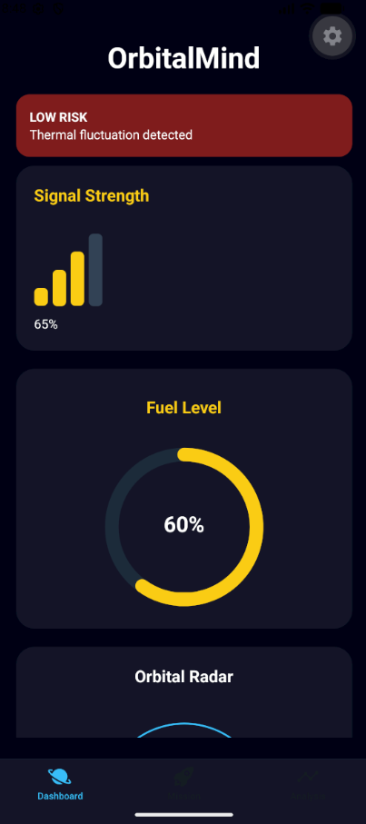
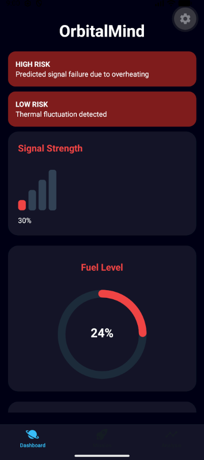

# 🚀 OrbitalMind

### Global Solution 2026.1 - Cross-Plataform Application Development | FIAP

<div align="center">
   
</div>

# Description

OrbitalMind is a space mission monitoring application designed to provide real-time telemetry analysis and predictive system diagnostics. The app tracks critical spacecraft parameters such as temperature, fuel levels, and signal strenght, helping operators identify potential risks before they become critical failures. The app contains a thematic DarkMode and through intelligent alerts and missions health analysis, OrbitalMindo improves situational awareness and supports safer, more efficient missions.

## 👤 Team

| Name                            | RM       |
| ------------------------------- | -------- |
| Felipe Souza Carvalho           | RM564779 |
| Riquelme Santos da Mata         | RM565053 |
| Rodrigo Kenshin Viana Matayoshi | RM564026 |

## 📸 App Screen

### 🏠 Home - Principal Dashboard

<div align="center">
   
</div>

_Overview of mission indicators: signal, fuel levels, radar and temperature.
OBS: Signal and fuel levels dahsboards change colors if the levels drops below certain point._

### Dashboard of Signal

<div align="center">
   
</div>
Indicates the signal level and if drops below certain point it change to another color.

### Dashboard of Fuel Levels

<div align="center">
   
</div>
The circle indicates the fuel guge levels. Each % lost reduces the circle size and it changes colors if below certain point.

### Dashboard of Radar

<div align="center">
   
</div>
Provides visual representation of nearby objects, changing the object colors if the signal is too low to indicate that it may not be accurate.

### Dashboard of Temperature

<div align="center">
   
</div>
Provides intel about the last 20 seconds of temperature of the spacecraft to help monitorate the fluctuations in a certain space of time.

### ⚙️ Mission Screen

<div align="center">
   
   
</div>
The Mission screen allows users to configure mission parameters and operational thresholds. Operator can customize mission settings, define temperature and fuel safety limits, and adjust applicatioon preferences such as theme selection.

### 📊 Analysis Screen

<div align="center">
   
   
</div>
The Analysis screen aggregates telemetry data and applies predictive diagnostics to evaluate spacecraft health. It generates risks assessments, mission healht scores and reccomendations, allowing operators to quickly identify anomalies and respond to potential system failures.

### ❗Differential

<div align="center">
   
   
</div>
The differentials implemented are alerts of high and low risk with the change of color of the dashboards that indicate that there is some sort of problem with the system. Futhermore Dark/LightMode and TypeScript for prediction

## 📱 Features

- [x] Dashboard with real-time data(simulated) of telemetry, temperature, fuel level and radar.
- [x] System of alerts that indicates low/high risk
- [x] AsyncStorage system
- [x] Navegation of 3 screens with Expo Router
- [x] Context API for global state
- [x] Mission form
- [x] DarkMode
- [x] Visual data validation
- [x] Prediction and health system
- [x] TypeScript
- [x] SafeAreaView

## 🛠️ Technologies

- React Native + Expo + React
- Expo Router
- AsyncStorage
- ContextAPI
- TypeScript
- Expo/vectors-icons
- React Native svg
- React Native Chart Kit

## ▶️ How to run

### Requirements

- Node.js
- Expo CLI `npm install -g expo-cli`
- Expo Go on the cell phone

### Installation

1. Clone git repository
   ```bash
   git clone https://github.com/Kenshin1072/GS_2026.1_CrossPlataform.git
   ```
2. Access the repository
   ```bash
   cd orbitalmind
   ```
3. Install the dependencies
   ```bash
   npm install
   ```
4. Run the project
   ```bash
   npx expo start
   ```
   Scan the QR Code with Expo Go to run on cell phone.

## 📹 Demonstration Video

_For late update: Insert here the video_

## 📄 License

This project was made for academics purposes - FIAP 2026.
