# 🚀 OrbitalMind

### Global Solution 2026.1 - Cross-Plataform Application Development | FIAP

<div align="center">
   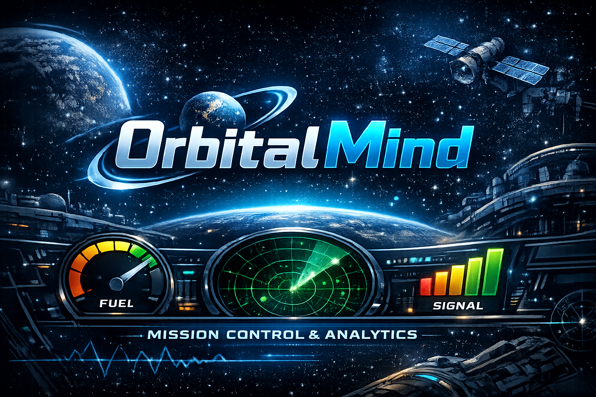
</div>

# Descrição

O OrbitalMind é uma aplicação de monitoramento de missões espaciais desenvolvida para fornecer análise de telemetria em tempo real e diagnósticos preditivos de sistemas. O aplicativo monitora parâmetros críticos da espaçonave, como temperatura, nível de combustível e intensidade do sinal, ajudando operadores a identificar riscos potenciais antes que se tornem falhas críticas.

A aplicação inclui um tema Dark Mode e, por meio de alertas inteligentes e análise da saúde da missão, melhora a consciência situacional e contribui para missões mais seguras e eficientes.

## 👤 Equipe

| Nome                            | RM       |
| ------------------------------- | -------- |
| Felipe Souza Carvalho           | RM564779 |
| Riquelme Santos da Mata         | RM565053 |
| Rodrigo Kenshin Viana Matayoshi | RM564026 |

## 📸 Telas do Aplicativo

### 🏠 Home - Painel Principal

<div align="center">
   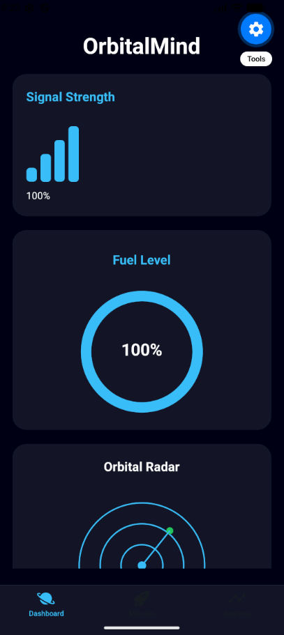
</div>

Visão geral dos indicadores da missão, incluindo intensidade do sinal, níveis de combustível, radar e temperatura.

### 📡 Painel de Sinal

<div align="center">
   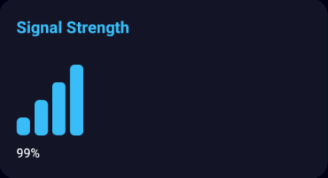
</div>
Exibe a intensidade atual do sinal. O painel muda de cor sempre que o nível do sinal fica abaixo de um limite predefinido.

### ⛽ Painel de Combustível

<div align="center">
   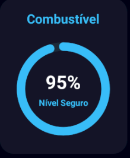
</div>
O indicador circular representa o nível de combustível da espaçonave. Conforme o combustível diminui, o indicador reduz proporcionalmente de tamanho e muda de cor quando níveis críticos são atingidos.

### 🛰️ Painel de Radar

<div align="center">
   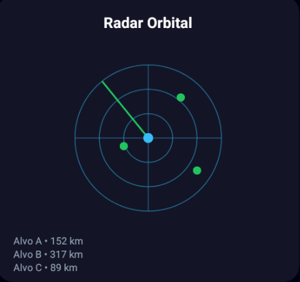
</div>
Fornece uma representação visual dos objetos próximos.

### 🌡️ Painel de temperatura

<div align="center">
   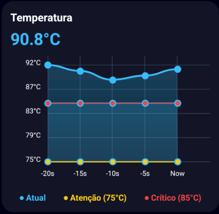
</div>
Exibe o histórico de temperatura da espaçonave durante os últimos 20 segundos, auxiliando os operadores no monitoramento das variações ao longo do tempo.

### ⚙️ Tela de Missão

<div align="center">
   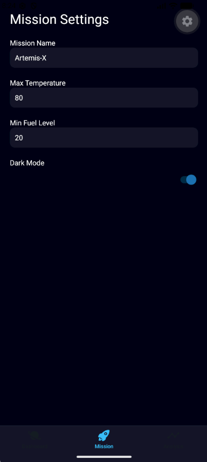
   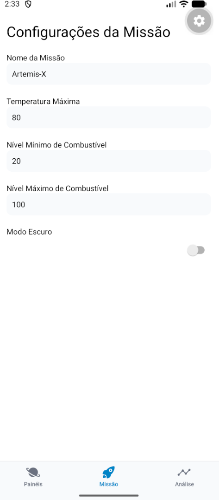
</div>
A tela de Missão permite que os usuários configurem parâmetros da missão e limites operacionais. Os operadores podem personalizar configurações da missão, definir limites de segurança para temperatura e combustível e ajustar preferências da aplicação, como a seleção de tema.

### 📊 Tela de Análise

<div align="center">
   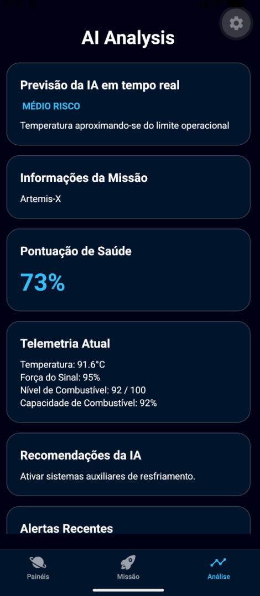
   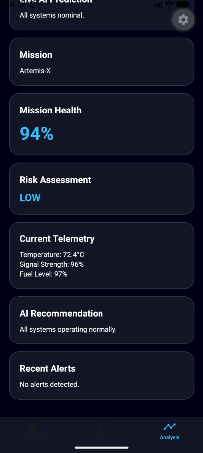
</div>
A tela de Análise reúne os dados de telemetria e aplica diagnósticos preditivos para avaliar a saúde da espaçonave. Ela gera avaliações de risco, pontuações de saúde da missão e recomendações, permitindo que os operadores identifiquem rapidamente anomalias e respondam a possíveis falhas do sistema.

### ❗Diferenciais

<div align="center">
   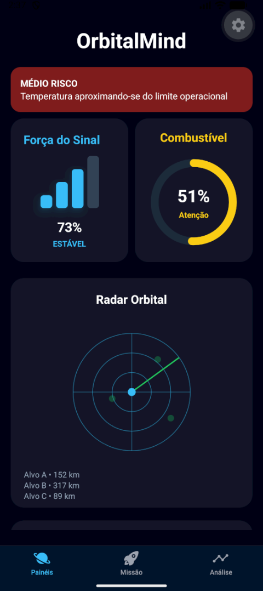
   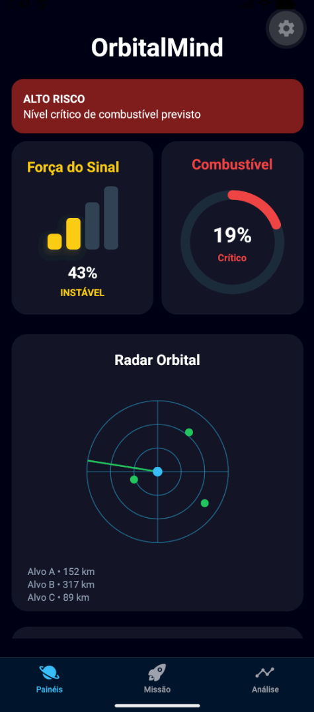
</div>
Os principais diferenciais implementados na aplicação incluem:

- Sistema de alertas para riscos baixos e altos.
- Mudanças dinâmicas de cor nos painéis para indicar problemas no sistema.
- Suporte aos modos Dark Mode e Light Mode.
- Análise preditiva implementada com TypeScript.

## 📱 Funcionalidades

- [x] Painel de telemetria em tempo real (simulado) com monitoramento de temperatura, combustível, intensidade do sinal e radar.
- [x] Sistema de alertas para situações de baixo e alto risco.
- [x] Integração com AsyncStorage.
- [x] Navegação entre três telas utilizando Expo Router.
- [x] Context API para gerenciamento global de estado.
- [x] Formulário de configuração da missão.
- [x] Suporte a Dark Mode.
- [x] Validação visual de dados.
- [x] PSistema de previsão e análise da saúde da missão.
- [x] Implementação de TypeScript.
- [x] Suporte ao SafeAreaView.

## 🛠️ Tecnologias

- React Native + Expo + React
- Expo Router
- AsyncStorage
- ContextAPI
- TypeScript
- Expo/vectors-icons
- React Native svg
- React Native Chart Kit

## ▶️ Como Executar

### Requisitos

- Node.js
- Expo CLI `npm install -g expo-cli`
- Expo Go instalado em um dispositivo móvel

### Instalação

1. Clone o repositório
   ```bash
   git clone https://github.com/Kenshin1072/GS_2026.1_CrossPlataform.git
   ```
2. Acesse a pasta do projeto
   ```bash
   cd orbitalmind
   ```
3. Instale as dependências
   ```bash
   npm install
   ```
4. Inicie a aplicação
   ```bash
   npx expo start
   ```
   Escaneie o QR Code utilizando o Expo Go para executar a aplicação em seu dispositivo móvel.

## 📹 Vídeo de Demonstração

[](https://youtu.be/w6gRikkBLig)

## 📄 Licença

Este projeto foi desenvolvido para fins acadêmicos como parte da Global Solution 2026 da FIAP.
